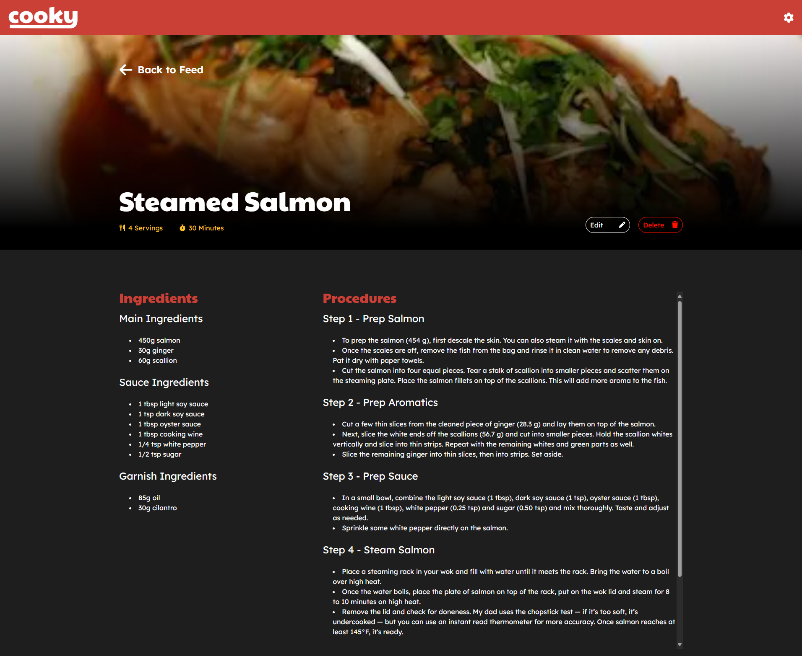
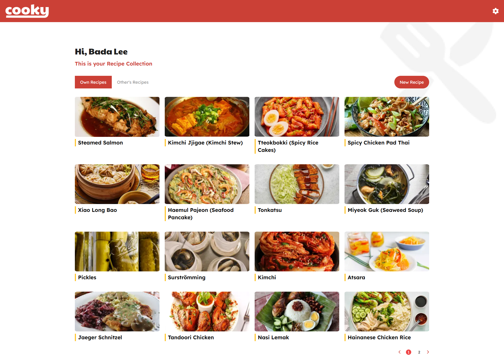

# Next.js Recipe Management Project - Frontend Trial

This repository contains code for a trial project exploring recipe management functionalities built using the Next.js framework. This project focuses on the frontend aspects of adding, viewing, and managing recipes.

## Demo

https://trial-project-generic-tech-agnostic.vercel.app/

## Tech Stack

**Client:** Reactjs, Nextjs

**Server:** Nodejs, Nextjs

**Styling:** TailwindCSS

**Deployment Platform:** Vercel

## Features

- Light/dark mode toggle
- Live previews
- Fullscreen mode
- Cross platform
- Mock API with Json Databese
- CRUD frontend implementation
- Mobile responsive
- User Auth local Storage

## Run Locally

Clone the project

```bash
  git clone https://github.com/Creedyfish/Trial-project-Generic-Tech-agnostic.git
```

Go to the project directory

```bash
  cd Trial-project-Generic-Tech-agnostic
```

Install dependencies

```bash
  npm install
```

Start the server

```bash
  npm run dev
```

## Deployment

First, run the development server:

```bash
  npm run dev
```

Open http://localhost:3000 with your browser to see the result.

## API Reference

#### POST Login

```http
  POST /api/auth/login
```

| Parameter  | Type     | Description                                    |
| :--------- | :------- | :--------------------------------------------- |
| `email`    | `string` | **Required**. email to Find user from database |
| `password` | `string` | **Required**. for User validation              |

#### POST SignUp

```http
  POST /api/auth/signup
```

#### GET all Recipes

```http
  GET /api/
```

#### GET Recipe

```http
  GET /api/recipes/${data}
```

| Parameter | Type     | Description                         |
| :-------- | :------- | :---------------------------------- |
| `data`    | `string` | **Required**. Name of item to fetch |

#### DELETE Recipe

```http
  DELETE /api/recipes/${data}
```

| Parameter | Type     | Description                          |
| :-------- | :------- | :----------------------------------- |
| `data`    | `string` | **Required**. Name of item to Delete |

#### Add Recipe

```http
  POST /api/recipes
```

| Request | Type     | Description                      |
| :------ | :------- | :------------------------------- |
| `data`  | `string` | **Required**. Data to add Recipe |

#### Update Recipe

```http
  PUT /api/recipes
```

| Request | Type     | Description                         |
| :------ | :------- | :---------------------------------- |
| `data`  | `string` | **Required**. Data to update Recipe |

## Appendix

For ADMIN privilege use login Info:

**Email:** admin@example.com

**Password:** admin

## Screenshots







